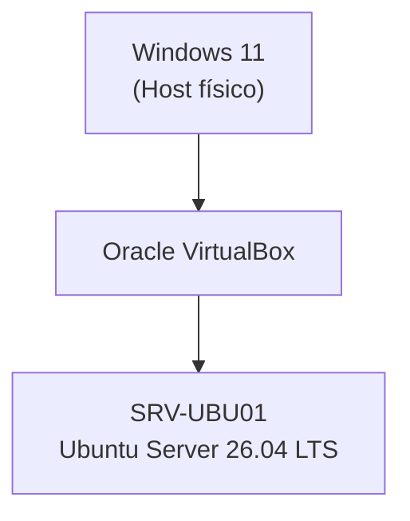

# Proyecto 01 · Instalación de Ubuntu Server

> Instalación de Ubuntu Server 26.04 LTS sobre Oracle VirtualBox como primer servidor del laboratorio.

---

## Descripción

Este proyecto documenta la instalación de Ubuntu Server 26.04 LTS sobre Oracle VirtualBox como punto de partida del homelab.

El servidor creado constituye la base sobre la que se desarrollarán los siguientes proyectos del laboratorio.

---

## Objetivos

- Instalar Ubuntu Server 26.04 LTS.
- Crear el primer servidor del homelab.
- Preparar el entorno para futuros proyectos.

---

## Tecnologías utilizadas

- Sistema operativo: Ubuntu Server 26.04 LTS
- Hipervisor: Oracle VirtualBox
- Acceso remoto: OpenSSH
- Gestión del almacenamiento: LVM

---

## Entorno del laboratorio

| Elemento | Valor |
|----------|-------|
| Sistema operativo host | Windows 11 |
| Hipervisor | Oracle VirtualBox |
| Sistema operativo | Ubuntu Server 26.04 LTS |
| CPU | 2 vCPU |
| RAM | 4096 MB |
| Almacenamiento | 40 GB (VDI dinámico) |
| Red | NAT |

---

## Arquitectura

La siguiente figura muestra la arquitectura del laboratorio al finalizar el Proyecto 01.

---

## Implementación

Durante la instalación se configuró el almacenamiento mediante LVM, se instaló OpenSSH para permitir la administración remota y se configuró la máquina virtual con una red NAT utilizando DHCP.

Para una explicación detallada del proceso de instalación, consulta la guía:

- [Instalación de Ubuntu Server](docs/instalacion.md)

---

## Resultado

La instalación finalizó correctamente y el servidor quedó preparado para comenzar las tareas de administración y configuración en los siguientes proyectos.

Al finalizar el proyecto se obtuvo un servidor con las siguientes características:

- Ubuntu Server 26.04 LTS instalado.
- OpenSSH habilitado.
- Almacenamiento configurado mediante LVM.
- Red NAT mediante DHCP.