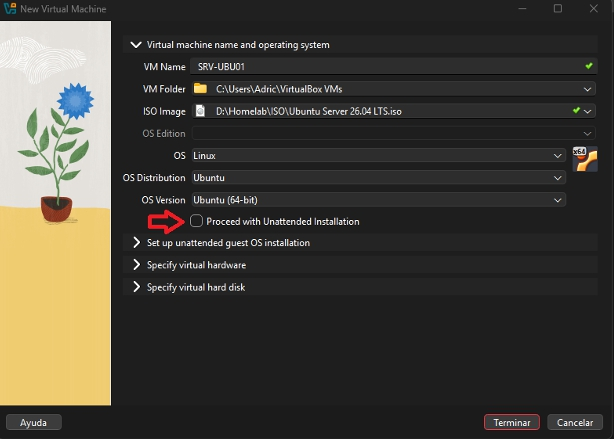
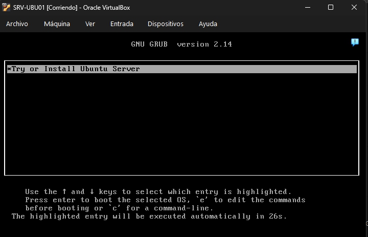
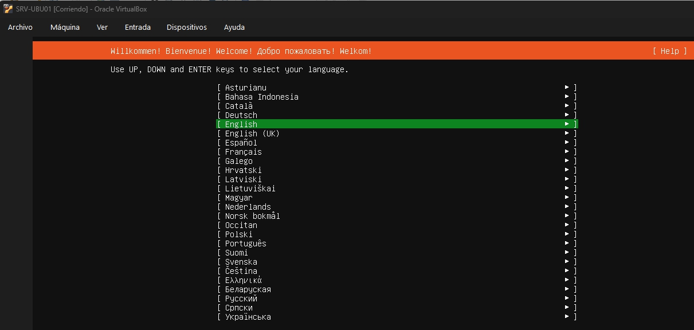
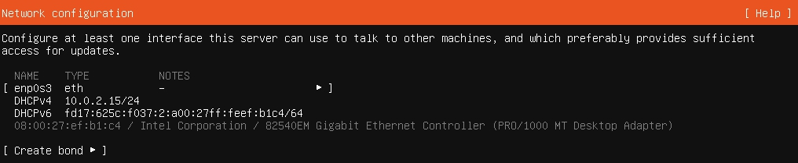
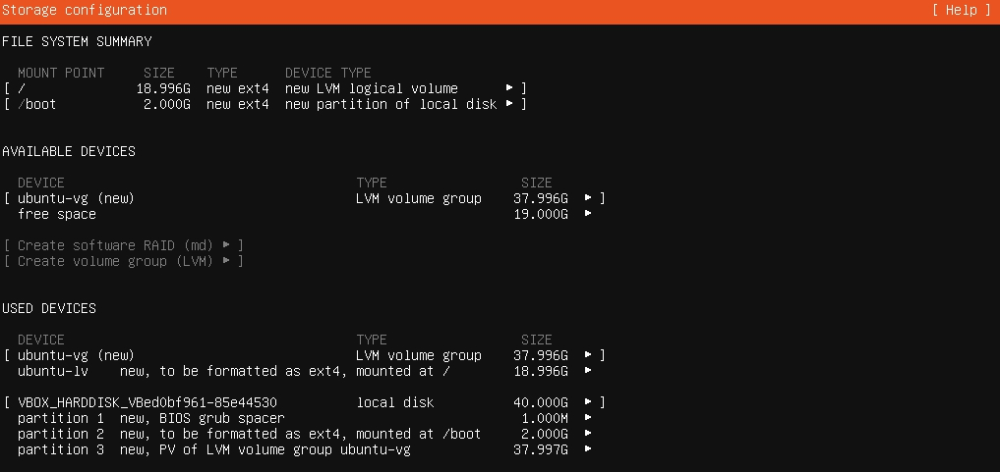
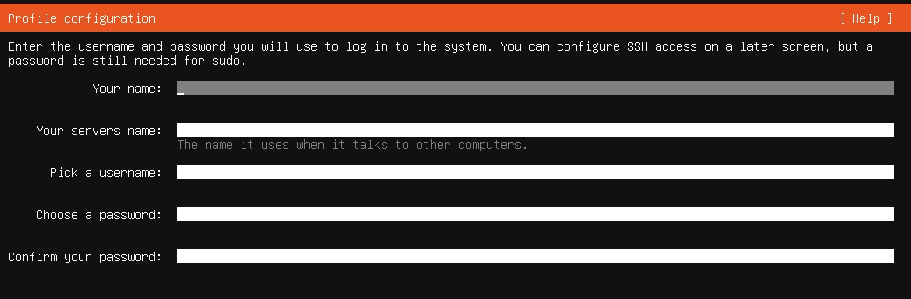
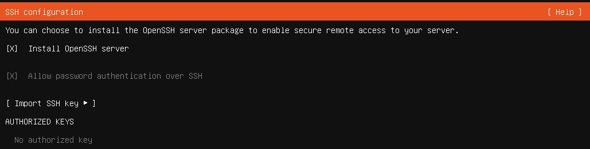

# Instalación de Ubuntu Server 

Guía de instalación de Ubuntu Server 26.04 LTS sobre Oracle VirtualBox como parte del Proyecto 01 del homelab.

Esta documentación describe el proceso seguido para reproducir el entorno de laboratorio.

---

## Entorno del laboratorio

| Elemento | Valor | 
|----------|-------| 
| Sistema operativo host | Windows 11 | 
| Hipervisor | Oracle VirtualBox | 
| Imagen ISO | Ubuntu Server 26.04 LTS | 
| Procesador | Intel Core i5-9400F | 
| Memoria RAM | 32 GB | 
| Almacenamiento | SSD Kingston 1 TB |

---

## Configuración de la máquina virtual

Antes de iniciar la instalación se creó una máquina virtual con la siguiente configuración. 

| Parámetro | Valor |
|-------|-------| 
| Nombre | SRV-UBU01 | 
| Carpeta | D:\Homelab\VirtualBox | 
| Sistema operativo | Ubuntu (64-bit) | 
| RAM | 4096 MB | 
| CPU | 2 vCPU | 
| Disco | 40 GB (VDI dinámico) | 
| Red | NAT |

La instalación desatendida de VirtualBox se deshabilitó para realizar manualmente toda la configuración del servidor. 

 

--- 

## Inicio de la instalación 

Una vez creada la máquina virtual se inició el sistema utilizando la imagen ISO oficial de Ubuntu Server 26.04 LTS. 
Se seleccionó la opción **Try or Install Ubuntu Server** para comenzar el proceso de instalación. 

 

--- 

## Configuración regional 

El idioma del sistema se configuró en inglés para trabajar con la terminología utilizada habitualmente en la documentación técnica y en entornos profesionales.

La distribución del teclado se mantuvo en español para adaptarse al teclado físico del equipo anfitrión. 
 

---

## Configuración de red 

Ubuntu Server detectó automáticamente la interfaz de red y obtuvo una dirección IP mediante DHCP. 

Se mantuvo la configuración NAT proporcionada por Oracle VirtualBox para disponer de conectividad a Internet durante la instalación sin modificar la red del equipo anfitrión.

| Parámetro | Valor | 
|-----------|-------| 
| Interfaz | enp0s3 | 
| IPv4 | DHCP | 
| IPv6 | Automática | 
| Tipo de red | NAT |

 

--- 

## Configuración del acceso a Internet

No se configuró ningún servidor proxy durante la instalación. 

Se mantuvo el mirror oficial de Ubuntu para descargar los paquetes y actualizaciones del sistema. 

Esta configuración es adecuada para un entorno de laboratorio con acceso directo a Internet mediante la red NAT de VirtualBox.

--- 

## Configuración del almacenamiento 

Se utilizó la configuración guiada del instalador seleccionando la opción **Use entire disk**.

El almacenamiento se configuró mediante **LVM (Logical Volume Manager)** para facilitar la gestión de volúmenes en futuros proyectos del laboratorio.

No se habilitó el cifrado del disco al tratarse de un entorno de prácticas. 
| Parámetro | Valor | 
|-----------|-------| 
| Disco | 40 GB | 
| Método | Use entire disk | 
| Gestión de volúmenes | LVM | 
| Cifrado | No | 

--- 

## Perfil del servidor 
Durante la instalación se definió la identidad inicial del servidor. 
| Parámetro | Valor | 
|-----------|-------| 
| Hostname | SRV-UBU01 | 
| Usuario | *** | 

Esta configuración identifica el servidor dentro del laboratorio y permite iniciar sesión con el usuario creado durante la instalación. 

---

## Configuración de OpenSSH 
Se instaló OpenSSH Server para permitir la administración remota del servidor mediante SSH. 

En este proyecto se mantuvo la autenticación mediante contraseña por tratarse de un entorno de laboratorio. En proyectos posteriores podrá sustituirse por autenticación mediante claves SSH.

OpenSSH permitirá administrar el servidor desde otros equipos del laboratorio sin necesidad de acceder directamente a la consola de VirtualBox.

---

## Finalización de la instalación
Una vez completada la instalación se reinició el servidor y se inició sesión con el usuario creado durante el proceso.

Se comprobó que el sistema arrancaba correctamente y que OpenSSH había quedado instalado.

---

## Resultado
La instalación finalizó correctamente y el servidor quedó preparado para comenzar las tareas de administración.

Configuración final del servidor:
- Ubuntu Server 26.04 LTS instalado.
- OpenSSH Server habilitado.
- Gestión del almacenamiento mediante LVM.
- Conectividad mediante NAT y DHCP.
- Primer servidor operativo del homelab.