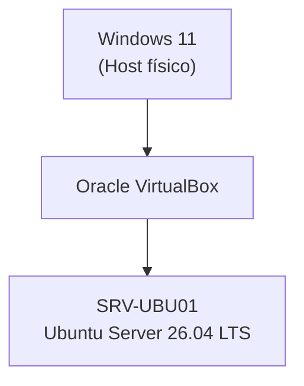

# Proyecto 02 · Puesta en marcha del servidor Ubuntu

> Puesta en marcha y verificación de Ubuntu Server 26.04 LTS para dejar el servidor preparado para los siguientes proyectos del homelab.

---

## Descripción

Este proyecto documenta la puesta en marcha de Ubuntu Server 26.04 LTS tras completar la instalación del sistema operativo.

Durante el proyecto se verificó la identidad del servidor, los recursos disponibles, la configuración de red, la conectividad, el estado de OpenSSH, los permisos del usuario administrador y el correcto funcionamiento de los principales servicios del sistema.

El objetivo es garantizar que el servidor se encuentra correctamente preparado antes de comenzar la instalación de nuevos servicios.

---

## Objetivos

- Verificar el estado inicial del servidor.
- Comprobar el correcto funcionamiento de los principales componentes del sistema.
- Validar la conectividad y los servicios básicos.
- Preparar el servidor para los siguientes proyectos del homelab.

---

## Tecnologías utilizadas

- Sistema operativo: Ubuntu Server 26.04 LTS
- Hipervisor: Oracle VirtualBox
- Acceso remoto: OpenSSH
- Gestión de paquetes: APT
- Administración de servicios: systemd

---

## Entorno del laboratorio

| Elemento | Valor |
|----------|-------|
| Sistema operativo | Ubuntu Server 26.04 LTS |
| Hostname | SRV-UBU01 |
| Hipervisor | Oracle VirtualBox |
| CPU | 2 vCPU |
| RAM | 4096 MB |
| Almacenamiento | 40 GB (VDI dinámico) |
| Red | NAT |

---

## Arquitectura

La arquitectura del laboratorio se mantiene respecto al Proyecto 01. Durante este proyecto se verificó el estado inicial del servidor para garantizar que se encuentra preparado para los siguientes proyectos del homelab.

---

## Implementación

Durante este proyecto se realizaron las comprobaciones básicas de administración del sistema:

- Identificación del servidor.
- Recursos del sistema.
- Configuración de red.
- Comprobación de conectividad.
- Actualización del sistema.
- Verificación de OpenSSH.
- Usuarios y permisos.
- Fecha y zona horaria.
- Espacio disponible en disco.
- Estado de los servicios.

La documentación detallada del proceso puede consultarse en:

- [Puesta en marcha del servidor](docs/puesta%20en%20marcha.md)

---

## Resultado

La puesta en marcha del servidor finalizó correctamente y el sistema quedó preparado para comenzar la instalación y configuración de nuevos servicios.

Al finalizar el proyecto se verificó:

- Identidad del servidor.
- Recursos del sistema.
- Configuración de red.
- Conectividad a Internet.
- Sistema actualizado.
- OpenSSH operativo.
- Usuario administrador correctamente configurado.
- Fecha y hora del sistema.
- Espacio disponible en disco.
- Servicios del sistema sin errores.
