# Puesta en marcha del servidor Ubuntu

Guía de puesta en marcha de Ubuntu Server 26.04 LTS como parte del Proyecto 02 del homelab.

Esta documentación recoge las comprobaciones realizadas para verificar que el servidor se encuentra preparado para los siguientes proyectos del laboratorio.

---

## 1. Identificación del servidor

Antes de comenzar las tareas de administración se verificó la identidad del servidor para confirmar el hostname asignado y obtener información general sobre el sistema operativo y el entorno de ejecución.

```bash
hostnamectl
```

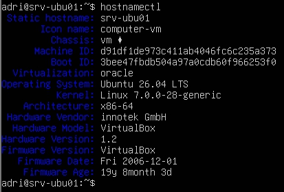

### Resultado

La comprobación confirmó que el servidor utiliza el hostname **srv-ubu01** y ejecuta **Ubuntu 26.04 LTS** sobre una máquina virtual de **Oracle VirtualBox** con arquitectura **x86-64**.

---

## 2. Recursos del sistema

Se verificaron los recursos de hardware asignados a la máquina virtual para confirmar que la configuración coincide con la definida durante la creación del servidor.

### Memoria RAM

Se comprobó la memoria disponible del sistema.

```bash
free -h
```

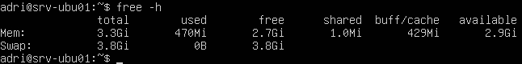

### Almacenamiento

Se revisó la estructura de discos y particiones del servidor.

```bash
lsblk
```

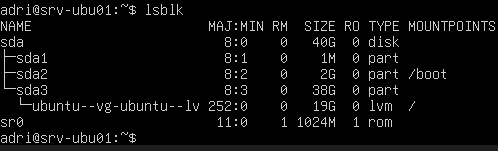

### Resultado

La comprobación confirmó que la máquina virtual dispone de la memoria y del almacenamiento configurados durante la creación del laboratorio.

---

## 3. Configuración de red

Se comprobó la configuración de red del servidor para verificar la conectividad y confirmar los parámetros asignados durante la instalación.

### Dirección IP

Se identificó la interfaz de red y la dirección IP asignada al servidor.

```bash
ip a
```

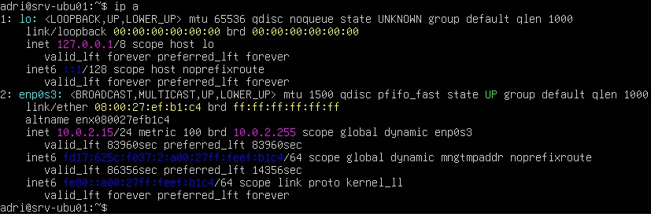

### Gateway

Se comprobó la puerta de enlace predeterminada utilizada por el sistema.

```bash
ip route
```

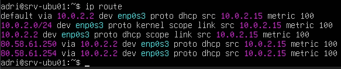

### Servidores DNS

Se revisó la configuración de resolución de nombres del sistema.

```bash
cat /etc/resolv.conf
```

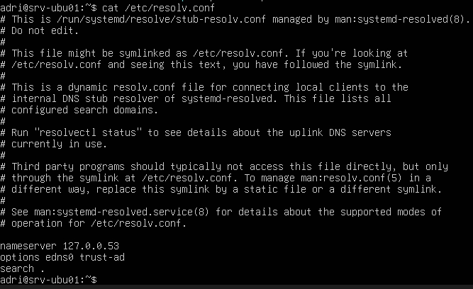

### Resultado

La configuración de red se encuentra correctamente establecida y el servidor dispone de una dirección IP obtenida mediante DHCP, utilizando la configuración NAT de Oracle VirtualBox.

---

## 4. Comprobación de conectividad

Antes de continuar con la configuración del servidor se verificó la conectividad de red para confirmar el acceso a Internet y el correcto funcionamiento de la resolución de nombres.

### Conectividad IP

Se comprobó la comunicación con una dirección IP pública.

```bash
ping -c 4 8.8.8.8
```

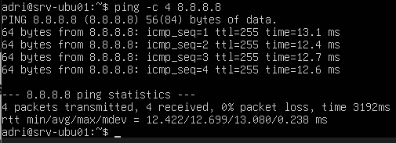

### Resolución DNS

Se verificó que el servidor es capaz de resolver nombres de dominio.

```bash
ping -c 4 google.com
```

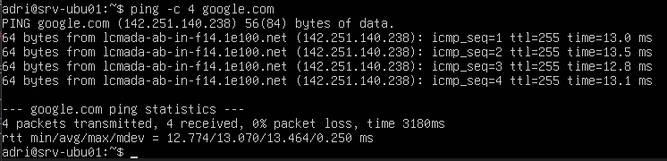

### Resultado

Las pruebas confirmaron que el servidor dispone de conectividad a Internet y que la resolución DNS funciona correctamente.

---

## 5. Actualización del sistema

Se actualizó la información de los repositorios y se instalaron las últimas actualizaciones disponibles para garantizar que el servidor parte de un estado actualizado.

### Actualización de repositorios

```bash
sudo apt update
```

### Instalación de actualizaciones

```bash
sudo apt upgrade -y
```

### Resultado

El sistema quedó actualizado con las últimas versiones disponibles de los paquetes instalados.

---

## 6. Verificación de OpenSSH

Se verificó el estado del servicio OpenSSH para confirmar que el servidor puede administrarse de forma remota mediante SSH.

### Estado del servicio

Se comprobó que el servicio se encuentra en ejecución.

```bash
systemctl status ssh
```

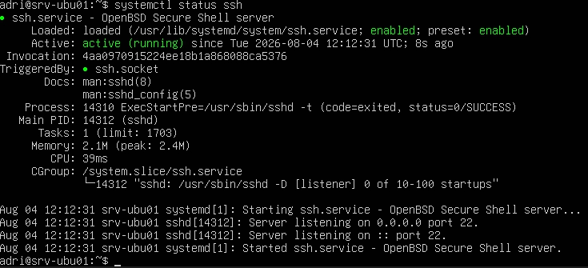

### Inicio automático

Se verificó que el servicio está configurado para iniciarse automáticamente durante el arranque del sistema.

```bash
systemctl is-enabled ssh
```

### Versión instalada

Se comprobó la versión instalada de OpenSSH.

```bash
ssh -V
```

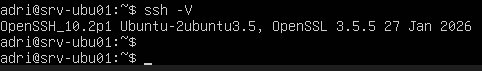

### Resultado

La comprobación confirmó que OpenSSH está instalado, activo y configurado para iniciarse automáticamente con el sistema, permitiendo la administración remota del servidor.

---

## 7. Usuarios y permisos

Se verificó el usuario utilizado para la administración del servidor y los permisos disponibles para realizar tareas administrativas.

### Usuario actual

Se comprobó el usuario con el que se ha iniciado sesión.

```bash
whoami
```

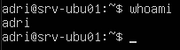

### Grupos del usuario

Se verificaron los grupos a los que pertenece el usuario administrador.

```bash
groups
```

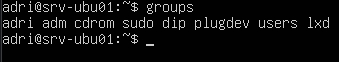

### Permisos administrativos

Se comprobó que el usuario dispone de privilegios para ejecutar tareas administrativas mediante **sudo**.

```bash
sudo -l
```

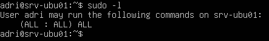

### Resultado

El usuario creado durante la instalación dispone de los permisos necesarios para administrar el servidor mediante **sudo**.

---

## 8. Fecha y zona horaria

Se comprobó la configuración de fecha, hora y zona horaria del servidor para garantizar que el sistema utiliza una referencia temporal correcta.

```bash
timedatectl
```

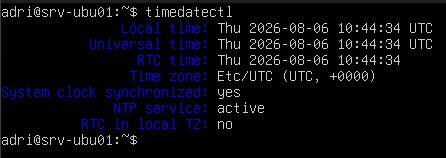

### Resultado

La configuración de fecha y hora del sistema se encuentra correctamente establecida para el entorno del laboratorio.

---

## 9. Espacio en disco

Se comprobó la utilización del sistema de archivos para verificar el espacio disponible en el servidor.

```bash
df -h
```

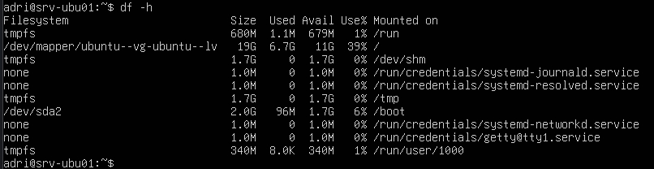

### Resultado

El sistema dispone de espacio suficiente para continuar con la instalación y configuración de nuevos servicios.

---

## 10. Comprobación de servicios

Se revisó el estado de los servicios del sistema para detectar posibles errores tras la instalación y configuración inicial.

```bash
systemctl --failed
```

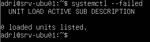

### Resultado

No se detectaron servicios en estado de error, por lo que el servidor se encuentra preparado para continuar con los siguientes proyectos del laboratorio.

---

# Resultado final

La puesta en marcha del servidor finalizó correctamente.

Durante este proyecto se verificó la identidad del sistema, los recursos asignados, la configuración de red, la conectividad, el estado de OpenSSH, los permisos del usuario administrador, la fecha y hora del sistema, el espacio disponible en disco y el estado de los principales servicios.

El servidor queda preparado para comenzar la instalación y configuración de nuevos servicios en los siguientes proyectos del homelab.